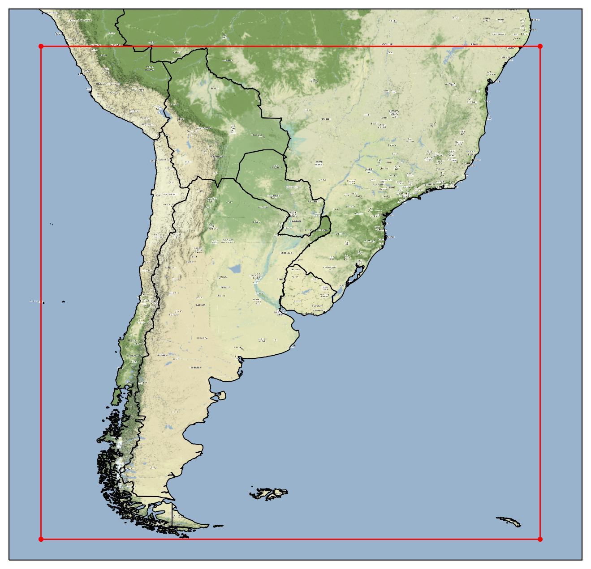

# Información general

En el marco del Sistema de Información de Sequías del Sur de Sudamérica (SISSA) se ha desarrollado una base de predicciones en escala subestacional y estacional con datos corregidos y sin corregir, con el propósito que permita estudiar predictibilidad en distintas escalas y también que sirva para alimentar modelos de sectores como agricultura e hidrología.

La base contiene datos en escala diaria entre 2000-2019 (sin corregir) y 2010-2019 (corregidos) para diversas variables incluyendo: temperatura media, máxima y mínima, así como también lluvia, viento medio y otras variables pensadas para alimentar modelos hidrológicos y de cultivo.

El área en la cual se tienen datos, corresponde a aquella que abarca el Centro Regional del Clima para el sur de sudamérica (CRC-SAS), que incluye a Bolivia, centro-sur de Brasil  y hasta la Patagonia incluyendo los países miembros como Chile, Argentina, Brasil, Paraguay, Uruguay y Bolivia. La resolución espacial de los datos es la reticula de 0.25°. El área abarcada se puede ver en la siguiente figura:  

   _Dominio SISSA delimitado en rojo_

La base fue generada a partir de datos de GEFSv12 para escala subestacional (<a href="https://www.ncei.noaa.gov/products/weather-climate-models/global-ensemble-forecast" target="_blank">GEFSv12</a>) y CFSv2 para escala estacional (<a href="https://www.ncei.noaa.gov/access/metadata/landing-page/bin/iso?id=gov.noaa.ncdc:C00878" target="_blank">CFSv2</a>). Para la corregir los datos, se utilizaron los datos del reanálisis de ERA5 (<a href="https://cds.climate.copernicus.eu/cdsapp#!/dataset/reanalysis-era5-single-levels?tab=overview" target="_blank">ERA5</a>).

